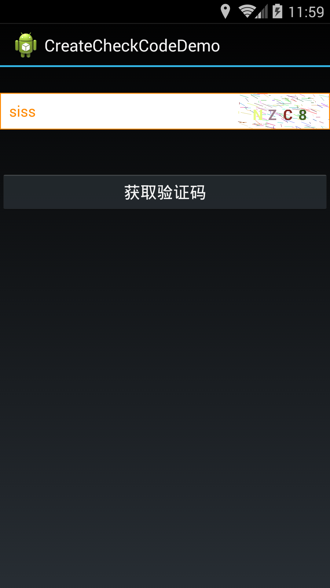

CheckCode
=========



### How to use

#### layout: 
```xml
    <com.createcheckcode.demo.CheckCodeLinearLayout
        android:id="@+id/checkcode_layout"
        android:layout_width="fill_parent"
        android:layout_height="40dp"
        android:layout_marginTop="28dp" >
    </com.createcheckcode.demo.CheckCodeLinearLayout>
```
